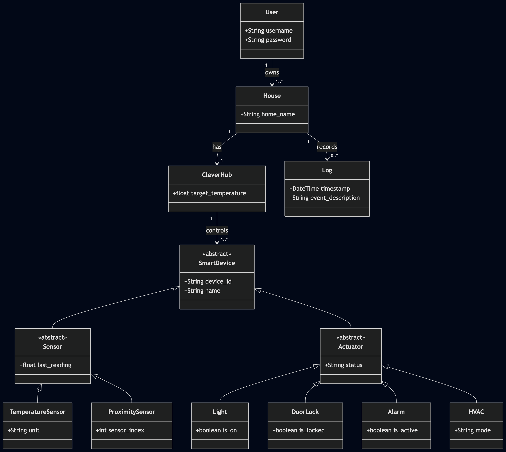
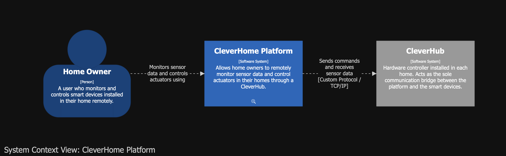
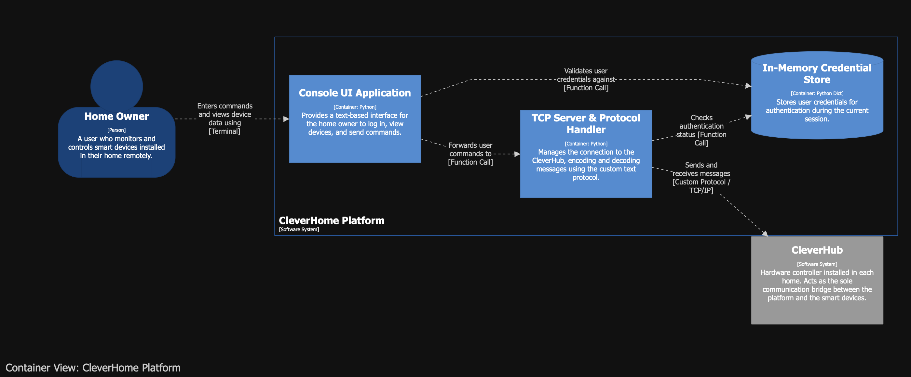
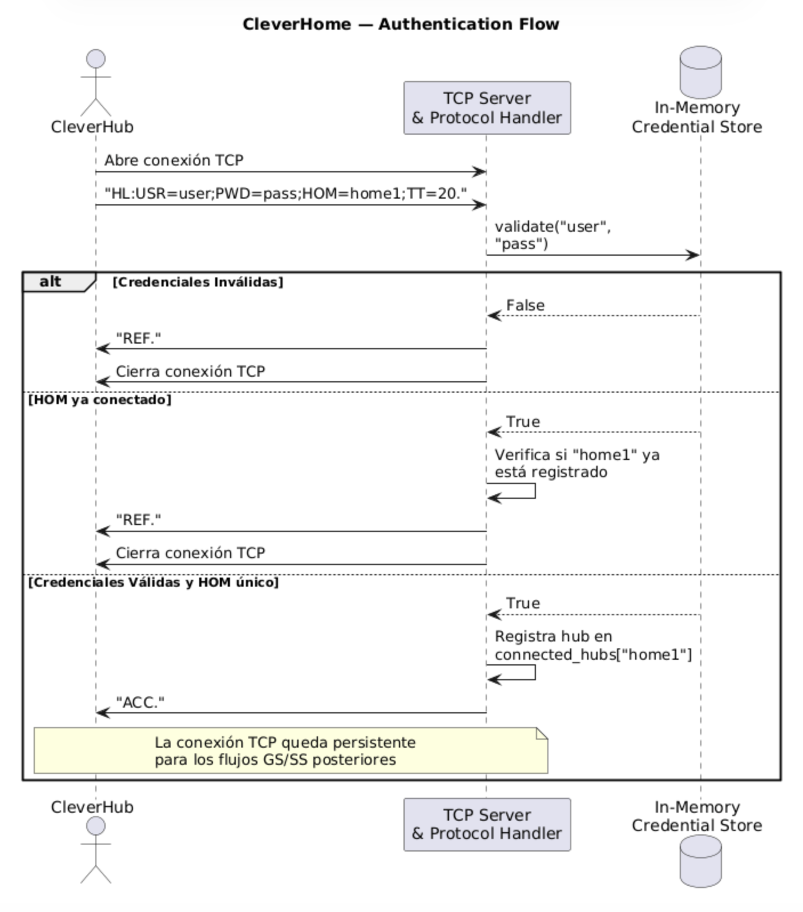
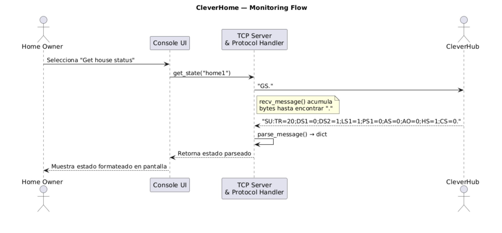
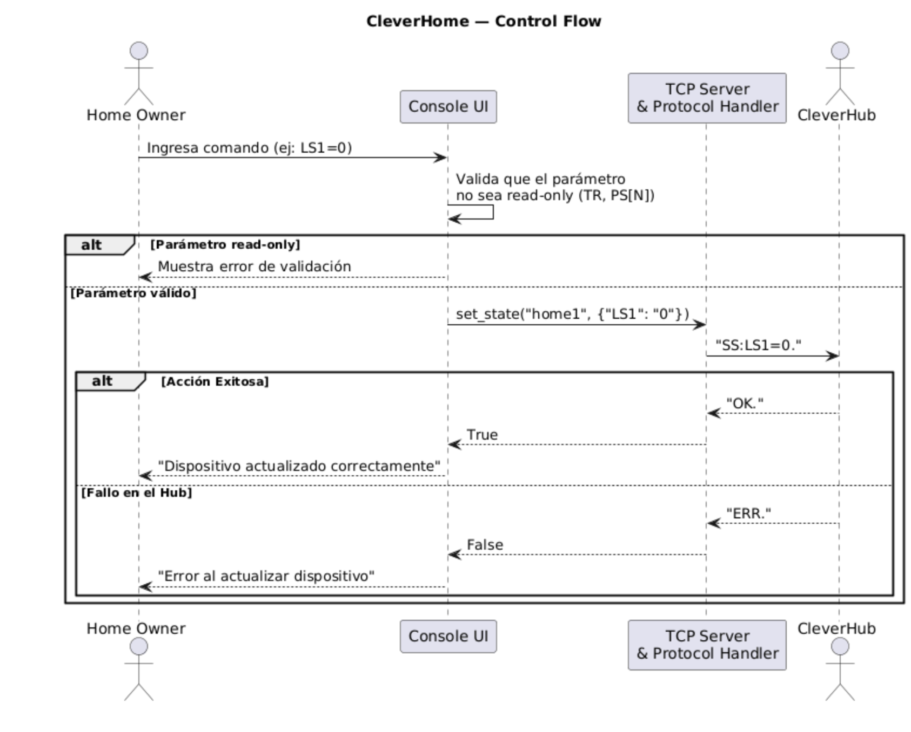
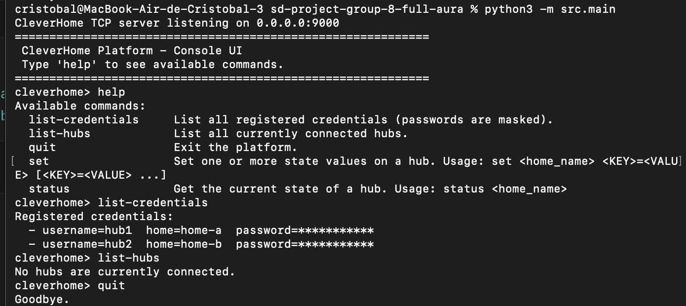

<!--
  INSTRUCTIONS FOR STUDENTS:
  - This is a report of what was delivered in THIS submission only, and whatever doesn't change between submissions.
  - Do not append and leave outdated data; replace or upadate all content below.
  - Fill every <!-- REQUIRED - -> and <!-- TODO - -> marker.
-->

<!-- REQUIRED: Replace with your team name -->
# Team Name
FULL AURA

<!-- SECTION: Team -->
## Team Members
Cristobal Gazitua
Diego Llull
Carlos Rencoret


|       Name        | GitHub User |
|-------------------|-------------|
|Cristobal Gazitua  |crisgazitua  |
|Diego Llull        |Im-diegollull|
|Carlos Rencoret    |cjrenco      |

---

<!-- SECTION: Work Division -->
## Work Division

Diego llull — Documentación y diseño: lidera diagramas (domain, C4, sequence), QAS, constraints, README. 
Carlos Rencoret — Core / Backend: parser del protocolo, TCP server, credential store. 
Cristobal Gazitua — Infra y UI: Console UI, Dockerfile, docker-compose, GitHub Actions, tests.


---

<!-- SECTION: Incomplete Items -->
## Incomplete Items

<!-- TODO: List anything not completed from the submission requirements, if any. -->

---

<!-- SECTION: Requirements  -->
## Requirements

<!-- TODO: All requirements artifacts for this delivery. -->

### Functionalities

This iteration of the CleverHome Platform delivers the following functionalities:

- **CleverHub authentication over TCP/IP**: the platform listens for incoming TCP connections from CleverHubs and validates them through an HL handshake, accepting connections with valid credentials (ACC) and rejecting unauthorized or duplicate ones (REF).
- **In-memory credential store**: a pre-loaded set of (username, password, home_name) credentials is used to authorize CleverHub connections. The store is hidden behind an abstract interface so it can be swapped for a database-backed implementation in future iterations without modifying any other module.
- **House state monitoring (GS)**: through the Console UI, the operator can request the current state of any connected hub. The platform sends a GS message to the hub and parses the resulting SU response, displaying all sensor and actuator values to the operator.
- **House state control (SS)**: through the Console UI, the operator can set one or more state values on any connected hub. The platform sends an SS message and reports whether the hub accepted (OK) or rejected (ERR) the change.
- **Console UI for the platform operator**: an interactive text-based interface lets the operator list connected hubs, query and update their state, list the registered credentials (with masked passwords), and exit the platform cleanly.
- **Concurrent hub support**: the TCP server accepts multiple CleverHubs simultaneously, each on its own thread, and tracks them by their unique home_name.

### Quality Attribute Scenarios

**QAS 1 — Security (Authentication)**
Aspect:    Description

Source: Unauthorized CleverHub OR external 
Stimulus: Attempts to connect with invalid or missing credentials
Artifact: TCP Server + Credential Store
Environment: Runtime, platform is online and accepting connections
Response: The platform validates credentials against the store and responds with REF (refused), closing the connection without exposing any internal information
Response Measure: 100% of unauthorized connection attempts are rejected, and no data from other houses is leaked

Justification: The platform will manage real homes with sensitive data (door locks, alarm states, occupancy patterns). Ensuring that only authenticated CleverHubs can connect is a fundamental requirement for user trust and data privacy. A breach here could allow an attacker to unlock doors or disable alarms remotely.

**QAS 2 - Maintainability/Modifiability**:

Aspect:    Description

Source: Development team
Stimulus: Replace in-memory credential store with an external database (e.g., PostgreSQL)Artifact: Credential Store module
Environment: Development time
Response: The change is made by modifying only the concrete implementation of the credential store interface, without altering the TCP Server, Console UI, or any other module
Response Measure: The change requires modification of at most 1 module and takes no more than 4 hours of development effort

Justification: The project description explicitly states that the credential store will be migrated to a more scalable method with external storage in the future. Designing for maintainability here ensures that this planned change does not cascade through the system, keeping maintenance costs low and enabling independent evolution of the storage layer.


### Technical Constraints

**1. Mandatory use of Python (Tecnical Constraints )**

Description: The plataform must be developed in python, with a strict
requirement to use python hints and pass static type checking using mypy library

Justification:  This constrains the technology choices for frameworks, libraries, and tooling (e.g., mypy for type checking, pytest for testing). While Python offers excellent readability and a rich ecosystem, it may impose performance limitations for high-throughput TCP connections compared to other languages (Go, Rust, node.js). 

**2. CleverHub communication protocol over TCP/IP (Tecnical Constraints)**
Description:The communication protocol between the platform and CleverHubs is pre-defined by the CleverHub development team and cannot be modified.

Justification: The platform must implement this exact text-based protocol over TCP/IP sockets. This constrains the communication layer to work with raw sockets and custom message parsing rather than using standard protocols like HTTP/REST or MQTT. Any future changes to the protocol will be dictated by the external CleverHub team, and the platform must adapt accordingl


### Domain Model



The domain model represents the problem space of the CleverHome Platform from a business perspective. The platform enables users to remotely monitor and control smart devices installed in their homes. Each home has a single CleverHub — a hardware controller that acts as the sole communication bridge between the platform and the devices inside the house. The platform never interacts directly with any smart device; all communication flows through the CleverHub.
Smart devices are categorized into two families: sensors, which are read-only and report environmental data, and actuators, which can be controlled remotely to perform physical actions. The platform also keeps a historical log of sensor readings and actions performed on each house.

**DescriptionCleverHomePlatform**: The central system that manages houses and authenticates users

**User**: A person who accesses the platform to monitor and control their homes

**House**: A registered home in the platform, associated with users and one CleverHubC

**CleverHub**: The hardware controller in each house that bridges the platform and the devices

**Log**: A historical record of sensor readings and actions performed on a house

**SmartDevice**: A general entity representing any device connected to a CleverHub
**Sensor**: A read-only device that reports data (TemperatureSensor, ProximitySensor)
**Actuator**: A controllable device that executes actions (SmartLight, DoorLock, Alarm, HVAC)
<!-- TODO: Diagram for the domain model, with explanations as needed. -->

---

<!-- SECTION: Design Overview -->
## Design Overview

<!-- TODO: Design overview of your solution for this delivery, including diagrams as requested. Add explanations as needed. -->

### C4 System Context Diagram



### C4 Containers Diagram



The system is divided into three containers, all running within the same Python process:
- **Console UI**: handles all user interaction, forwarding commands to the TCP Server.
- **TCP Server & Protocol Handler**: manages CleverHub connections and encodes/decodes all protocol messages.
- **In-Memory Credential Store**: stores pre-defined hub credentials and validates them on connection. Isolated behind an interface so it can be replaced with a database-backed store in the future without modifying any other container. It is represented as a data store (cylinder) because its role is logically equivalent to a database, it is the authoritative source of credential data, and it is explicitly designed to be swapped for an external database in a future iteration.

### UML Sequence Diagrams

**Authentication Flow** — shows how a CleverHub connects and authenticates against the platform.



**Monitoring Flow** — shows how the platform requests and receives the state of a house.



**Control Flow** — shows how the platform sends commands to a house and handles success or failure.



### Program Structure

The codebase is organized into focused modules under `src/`, each with a single responsibility:

- **`src/protocol/`** — pure functions and data classes for the CleverHub text protocol. Contains the `Message` dataclass, `parse_message` (string → Message), and `serialize_message` (Message → string). No I/O, no sockets — fully testable in isolation.
- **`src/credentials/`** — credential storage. Defines the abstract `CredentialStore` interface and the `InMemoryCredentialStore` implementation. The abstraction supports the Maintainability QAS: future iterations can replace the in-memory store with a database-backed one without touching any consumer.
- **`src/server/`** — the TCP server. `CleverHomeTCPServer` accepts incoming connections, performs the HL handshake against the credential store, and on success registers the connection as a `HubConnection`. After the handshake, the platform takes the active role: `HubConnection` exposes `send_get_state()` and `send_set_state()` methods that the UI uses to drive the conversation with the hub.
- **`src/ui/`** — the Console UI. Implements the Command pattern: each operator command (`list-hubs`, `status`, `set`, `list-credentials`, `help`, `quit`) is its own class implementing the `Command` interface. The `ConsoleUI` class runs the read-eval-print loop and dispatches to the appropriate command. Adding a new command requires no changes to the loop or to existing commands.
- **`src/main.py`** — the entry point. Wires up the credential store, starts the TCP server in a background daemon thread, and runs the Console UI on the main thread.

The dependency direction is one-way: UI depends on Server and CredentialStore (interface), Server depends on Protocol and CredentialStore (interface), and Protocol depends on nothing. This makes each module independently testable and replaceable.


### Dockerized Structure

The CleverHome Platform is packaged as a single container running both the TCP server and the Console UI in the same Python process. This is appropriate for the current iteration: the UI and the server share an in-memory state (the registered hub connections), and splitting them into separate containers would require introducing inter-process communication that adds no value at this stage. Future iterations may split them as the design evolves.

- **`Dockerfile`** — builds the platform image from `python:3.12-slim`, installs dependencies from `requirements.txt`, copies the `src/` directory, and starts the application with `python -m src.main`. A `.dockerignore` excludes tests, caches, and version control metadata to keep the image small.
- **`docker-compose.yml`** — defines a single service `platform` with the TCP port `9000` mapped to the host, an interactive TTY enabled (so the Console UI can read from the terminal), and an automatic restart policy. The CleverHub simulator is intentionally **not** included in this compose file: the simulator represents external hardware that connects to the platform from outside.

To run the simulator and connect it to the platform, the operator executes a separate `docker run` command, as documented in the next section.

---

<!-- SECTION: Usage -->
## How to Run and Use

<!-- TODO: Provide exact commands and steps. Include screenshots of the UI for all mayor functionalities. -->

### Prerequisites

- **Docker** (24.0 or later) with Docker Compose v2. Required to build and run the platform image and to launch the CleverHub simulator.
- **Python 3.14.3+** (only required if running the platform natively without Docker, e.g. for development).
- **A terminal with TTY support**. The Console UI is interactive and reads from stdin.

No other dependencies are required: the Docker image bundles Python and all Python dependencies.

### Running the Platform and Dependencies

From the repository root, build and start the platform:

```bash
docker compose run --rm --service-ports platform
```

The flag `--service-ports` is required for the TCP port `9000` to be exposed; `--rm` removes the container after it exits. The platform will print a startup banner and the prompt `cleverhome> `.

Alternatively, to run the platform natively (useful during development):

```bash
pip install -r requirements.txt
python -m src.main
```

In a **separate terminal**, launch the simulator pointing at the platform:

```bash
docker run --rm -it secheverriag/cleverhub-sim:p1a host.docker.internal 9000 hub1 password123 home-a
```

- `host.docker.internal` is the special hostname that lets a container reach the host machine, where the platform is listening.
- `hub1` / `password123` / `home-a` are the username, password, and home name. They must match a registered credential in the platform's credential store.

The platform ships with the following pre-loaded credentials (see `src/main.py`):

| Username | Password       | Home Name |
|----------|----------------|-----------|
| hub1     | password123    | home-a    |
| hub2     | password456    | home-b    |

### Using the Platform

Once the platform is running, type `help` at the prompt to see all available commands:

| Command                            | Description                                            |
|------------------------------------|--------------------------------------------------------|
| `help`                             | Show the list of available commands.                   |
| `list-hubs`                        | List all currently connected hubs.                     |
| `list-credentials`                 | List all registered credentials (passwords are masked).|
| `status <home>`                    | Query and display the current state of a connected hub.|
| `set <home> <K>=<V> [<K>=<V> ...]` | Send one or more state updates to a connected hub.     |
| `quit`                             | Exit the platform.                                     |

**Example session** (with the simulator already connected as `home-a`):

### UI Screenshots

<!-- TODO: Add screenshots of all mayor features of your UI in use. -->


---

<!-- SECTION: Tests -->
## Tests

### Description

The test suite covers the three core modules of the platform: protocol parsing/serialization, credential storage, and the TCP server. All tests follow the arrange/act/assert structure explicitly, and the suite mixes unit tests (for pure logic such as the parser and the credential store) with integration tests (for the TCP server, which is exercised over real sockets on a free port).

The suite includes both valid cases and invalid cases. The latter are essential because the platform must be robust against malformed protocol messages, wrong credentials, duplicate hub names, and missing or malformed user input. Specifically:

- **Protocol tests** validate parsing of well-formed messages (HL, GS, SS, SU, OK, ERR), serialization round-trips, and rejection of malformed input (missing terminator, unknown message type, malformed parameters).
- **Credential store tests** validate correct authentication for valid credentials, rejection of wrong passwords, unknown usernames, unknown homes, and empty inputs. They also verify the encapsulation of the store (the returned credential list cannot be used to mutate internal state) and the immutability of the `Credential` dataclass.
- **TCP server tests** validate the full HL handshake against a running server: ACC for valid credentials, REF for invalid credentials, REF for duplicate home names, REF for non-HL first messages, and proper registration of authenticated hubs in the connected-hubs list.

### Running Tests

From the repository root:

```bash
pip install -r requirements.txt
pytest
```

Pytest will discover all tests under `tests/` and run them with verbose output. All tests must pass on the `feature/P1A` branch. The same suite is executed automatically on every push and pull request via GitHub Actions.


### Type Checking

The project uses strict mypy type checking, configured in `mypy.ini`. To run it locally:

```bash
mypy src/ tests/
```

Type checking must complete with no errors. The same check is enforced in CI through a dedicated GitHub Actions job.

---

<!-- SECTION: AI Use -->
## AI Use

See [AI.md](./AI.md) for the AI use declaration for this submission.
